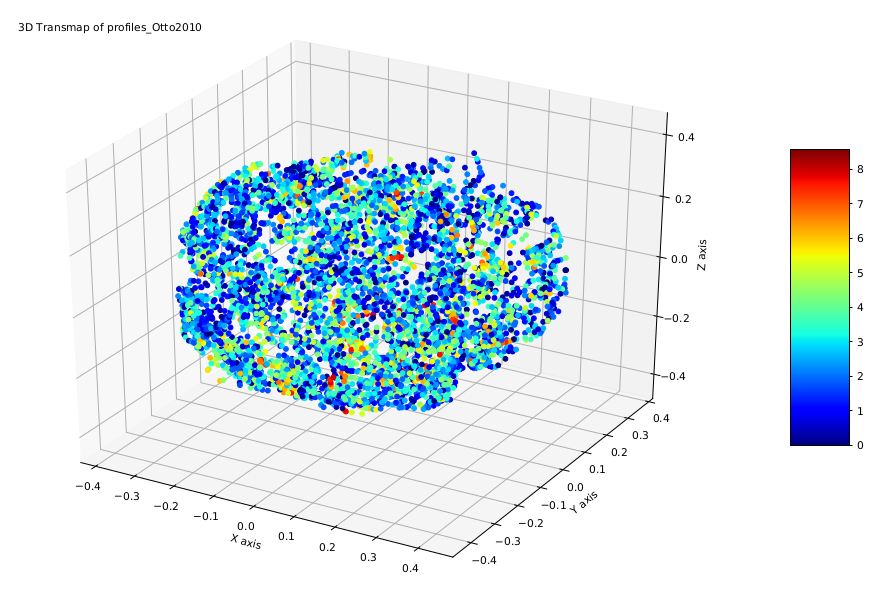
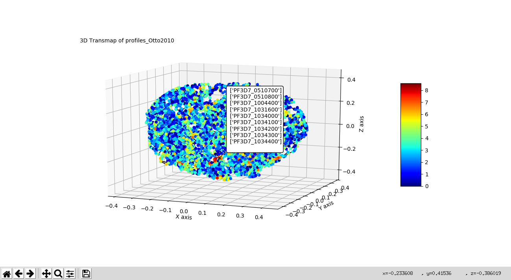

# 3D_transmap_Meraouna


## Description :
Small python program used to analyse the spatial correlations and associations between 3D genome organisation and gene transcription.


## Requirements :

### System :
* Linux : 
This program has only been tested on a Linux environment and thus is not guaranteed to work on other ones.

### Python packages :
In order to be able to run this program of course you need to have python3 but also some python packages :
* `pandas`
* `NumPy`
* `SciPy`
* `Matplotlib`

### Data files :
Two input data files are required to run the program :
* gene positions data file.
* gene expression data file.


## Script files :

#### genefiles.py
This script is used to read the data files and turn them into pandas data frames, it also gives the overlapping genes between the two files.

#### distcorr.py
This script is used to create the distance matrix out of the gene positions data frame and the correlation matrix out of the gene expression data frame, also used to get the sum of the correlations of the closest genes for each gene.

#### visual.py 
This script is used to get a 3D visual of the correlation between the genome organisation and the gene expression.

#### main.py
This is the main script of the program it's the one that must be run, it process the whole steps of the program through the other scripts and beeing a link.


## Usage :
1. First clone this repository :
```shell
$git clone https://github.com/hocinebib/3D_transmap_Meraouna.git 
```
or download it.

2. To run the program use the following command line :
```shell
$python3 main.py gene_position_file gene_expression_file nbr_of_close_genes 
```


### Exemple of usage :
If you are on the 3D_transmap_Meraouna repository you can type the following command line to run the programm on *plasmodium falciparum* with a selection of the 10 closest genes :
```shell
$python3 src/main.py data/SCHIZONTS.genes_pos.txt data/profiles_Otto2010_copy.min 10 
```


## Result :
At the end of the program process a window will appear with the 3D scatter plot of the result, the points represents the genes and those are coloured following the correlation sum of the closest genes associated to them, you can hover a point with the mouse to get the name of the gene, the plot will also be saved as pdf on the result repository under the name of the gene expression file name.
Here is an exemple of a result plot :



